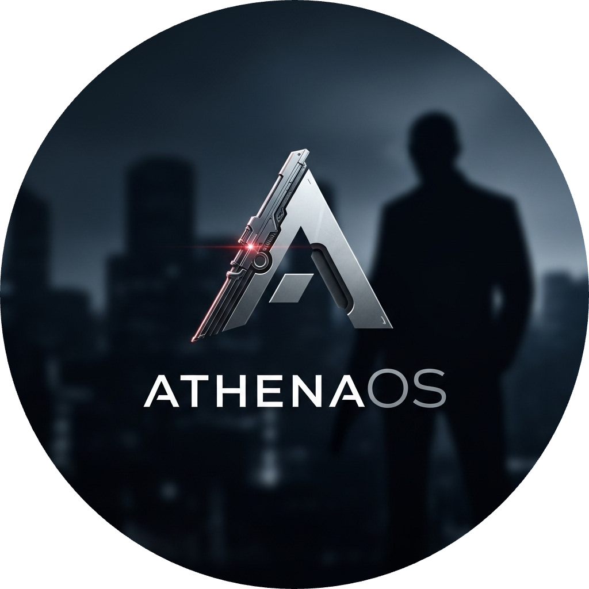

---

<h1 align="center">
  
</h1>

---

  <strong style="font-size: 1.6em;">Professional Cyberwarfare Operative</strong> 
  <em>Specialist in Stealth, Deception, and Intrusion</em>

  

  <strong>Currently Exploring AI Warfare, AI Consciousness, AGI, and Quantum Computing</strong>

---

  
  

---

   <strong>Spearheading</strong> the charge on <strong>AthenaOS’s ARM64 Fedora variant</strong>, for <strong>Special Forces</strong> hacking, meticulously engineered for <strong>macOS VMware Fusion</strong>. Driving the relentless evolution of the <strong>ShadowStrike AthenaOS Theme</strong> <i>a shadow-forged, midnight hacking OS spy theme, cloaked in stealth and precision.</i> On a mission to flawlessly port <strong>Pop!_OS Cosmic</strong> to VMware Fusion, while pushing <strong>Wayland support</strong> to its absolute limits on <strong>Apple Silicon virtualization</strong>. <strong>Breaking barriers</strong>, <em>shattering boundaries</em>, and <strong>redefining the future</strong> of virtualization.

<ins>**ShadowStrike AthenaOS Edition**</ins> **is an operating system designed for professionals, combining:**

  
  - The **security** of **Fedora**
  - The **tiling** features of **Pop!_OS Cosmic**
  - **Performance** enhancements and the base of **AthenaOS**
  - **Specialized Toolset Selector** minimizing bloat based on hacking roles
  - **Blackarch Docker container**
  - **ARM64** support with **VMware Fusion**
  - Snapshots of **VMware Fusion**
  - Delivered in the form of a optimized **VMDK** file for VMware Fusion
  - VMDK has storage **shrinking/expansion** capabilites
  - **MidnightStrikeOPS** Theme
  - **Custom Hacking Gemini 2.5 Pro State-Of-The-Art AI Toolkit and Mentor** [**C.E. - Restricted**]
  - Strong **Wireguard VPN** Setup [**C.E. - Restricted**]
  - **Custom** Fish + OhMyPOSH Setup + Fastfetch
  - **Custom** Ghostty setup + BigBlueTerm Nerd Fonts Mono + figlet shadow setup + lolcat + Custom glsl Shaders
  - **Custom** iTerm2 setup + Exclusive Terminal Background + Stage Manager + Lockdown Mode + Automatic Privacy/Security Script + LS Firewall & Default Firewall + State-Of-The-Art AI DNS Malware Filter + Antivirus + VMware Fusion + Unlimited Free macOS Daily Wallpaper Generator (Flux Model)
  - Signal + Telegram **Encrypted Communication Networks** Built-In
  - **Additional Defensive Toolset**
  - Many different **GNU/Linux Kernels** to choose from
  - **NIST Feed**
  - **HTB Toolkit** for Learning
  - **Hacking Menus** Based On Roles
  - **GHIDRA** Official NSA Reverse Engineering Toolset included
  - Even **More**

# MacOS Exclusives
- **Homebrew Setup**
- **Custom-Tuned iTerm2:** Bespoke terminal environment built for speed and efficiency.
- **iTerm2 ImageCat custom gif loader**
- **Exclusive Wallpapers:** Includes a custom background for the terminal and the *Flux Model* for unlimited, AI-generated macOS wallpapers daily.
- **Optimized Stage Manager:** Pre-configured setup for a seamless and productive workflow.
- **Proactive Lockdown Mode:** System-wide integration for maximum security posture.
- **SIP Enabled and all macOS security enhancements enabled**
- **Jamf** Enterprise-level security
- **Automatic Security Script:** Custom script that continuously enforces privacy and security best practices.
- **Dual-Layer Firewall:** Combines the default macOS firewall with the power of Little Snitch for comprehensive traffic control combined with a Berkeley Packet Filter Monitoring, Stealth Mode, Incoming Traffic Blocked, Browser VPN, Strong Wireguard Configuration, and DNS-Over-HTTPS
- **AI-Powered DNS Filtering:** State-Of-The-Art DNS filter that blocks malware and malicious sites before they can even load.
- **Integrated Antivirus:** Core antivirus protection built into the system.
- **Cloud Browser/Browser-Proxy:** for reducing malware
- **VMware Fusion:** is included, ready for all virtualization needs.
- **Password Manager + Authenticator Built-in**
- **VPN Built-in**
- **Highly Advanced Audio Setup:** For listening while hacking, this audio setup combines my advanced audio knowledge from DJing, Music Production, and Playing the Guitar into producing the best sounds possible on the OS. (YTM + MyNoise + Brain.fm + SomaFM **[DEFCON Radio]**) (**DO NOT ABUSE SOMAFM or MyNoise**, SomaFM are a **not-for-profit** donation-based radio channel and **MyNoise** is also not-for-profit) (Turn off SomaFM and MyNoise if not using it) (If you like **SomaFM** please donate)
- **Custom Cursor** + **Custom Cursor Click Effect**
- **Productivity Toolset**
- **Microsoft Office** installed by default
- **OperaGX + OperaAir**
- **DuckDuckGo** browser enhancements and search engine
- **Calibre Installed + Readest + Audiblez** (https://github.com/santinic/audiblez)
- **Google AI Studio + Google Collab + Kaggle + HuggingFace** (AI Websites) Bookmarked
- **Raycast + Apple Intelligence**
- **Time Machine Backups**
- **File Vault Encryption**
- **ice**: macOS top bar theme
- **pipx** support

---

<ins>**ShadowStrike AthenaOS Edition**</ins> is as much a **ideology** as an **operating system.** It is engineered from the ground up for **learning cybersecurity**, **special forces hacking operations**, and **professional penetration testing**. <ins>**ShadowStrike AthenaOS Edition**</ins> takes the best parts from all major hacking operating systems and combines them into one, following Apple Design philosophies combined with all my knowledge of Cybersecurity creating the ultimate operating system with a stable, bug-free experience. 

---
<h1 align="center">Trophies</h1>

  

---

<h1 align="center">Github Rating</h1>

  

---
