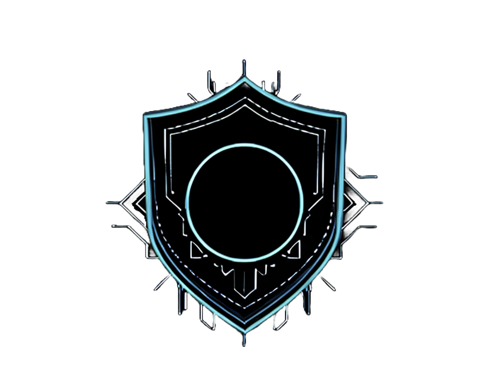

---

<h1 align="center">CY83R-3X71NC710N</h1>

  <strong>Cybersecurity Researcher & Developer</strong> 
  <em>Specializing in Offensive Security, OS Internals, and AI-driven Tooling</em> 
  <em>Actively Studying: Penetration Testing, Bug Bounty Hunting, and Zero-Day Research</em> 
  <strong><em>Trajectory: Tier 1 Exploit Development at the level of NSA's TAO and Google's Project Zero</em></strong>

---

### About Me

My fascination with technology began not with formal coursework, but with a fundamental curiosity about how systems work. This passion, which I've pursued since the age of 12, led me to cybersecurity. I have now spent five years deeply immersed in systems engineering, offensive security tradecraft, and autonomous tool development. My focus is on building robust, security-first solutions and pushing the boundaries of what's possible at the intersection of AI and systems security. I am driven by taking on complex challenges and engineering effective, elegant solutions.

---

### Experience

**Founding Security Engineer (Intern)** | **Maze3 Studios LLC** | *July 2025 – Present*
* Building the company's security program from the ground up for a new game development studio.
* Solely responsible for all offensive and defensive security research, planning, and implementation.
* Advising the co-founders on secure coding practices, infrastructure hardening, and risk management.

---

### Key Achievements & Recognition

* **NSA Codebreaker Challenge (2023-2024)**
    * Placed #72 out of 450+ competing institutions, competing solo against multi-person university teams to finish in the top 16% nationally.
    * Reached Level 7 of the national challenge within the first 10 days of the four-month competition, securing the #1 rank on the institutional leaderboard.
    * Pioneered the high school's first-ever participation in the collegiate-level program through direct outreach and approval from the NSA.

* **Cyberstart America National Competition (2022–2024)**
    * Recognized as a **National Cyber Scholar with Honors** for three consecutive years.
    * Consistently placed in the **top 1% of tens of thousands of participants** by achieving the maximum possible points across all program years.
    * Earned **$12,000 in scholarships** for exceptional performance.

* **GIAC Advisory Board**
    * Invited to join this elite guidance community as a recognized top scorer on SANS/GIAC certification exams.

* **FBI Teen/Youth Engagement and Mentorship (TEAM) Program**
    * Selected for the competitive federal program, receiving mentorship from Bureau personnel.

---

### Education & Certifications

* **Certifications:**
    * GIAC Security Essentials (GSEC)
    * GIAC Foundational Cybersecurity Technologies (GFACT)

* **Academic Honors & Awards:**
    * AP Scholar with Honors
    * Recognized as one of the only dual-award recipients (Business & Computer Science) in a graduating class of ~1,000 students.
    * Verified Member of the GitHub Developer Program.

---

   <h1>Featured Projects</h1>

---

  

---

#### **ShadowStrike OS - [Private Repository]**
A custom, security-focused Linux distribution engineered for penetration testing and security research. This project is my primary development testbed for integrating novel security tools and system hardening techniques.
* **Architecture:** Built on a hardened Fedora base, integrating the Pop!_OS tiling window manager (COSMIC), and leveraging a Blackarch Docker container for an expanded toolset.
* **Key Features:** Role-based tooling menus, ARM64 virtualization support, integrated Wireguard configurations, and a custom AI-powered assistant for automating research tasks.
* **Future Roadmap:** Researching the integration of post-quantum cryptography standards and developing more sophisticated adversarial AI threat modeling tools.

---

  

---

#### **Eclipse Shield - AI-Powered Productivity Analyzer with Enterprise Security** - [View Repository](https://github.com/CY83R-3X71NC710N/Eclipse-Shield)
An intelligent productivity management system that uses AI to analyze user browsing patterns and block unproductive websites based on contextual task understanding. The application features a web-based backend that communicates with browser extensions to provide real-time productivity insights and adaptive website filtering.

**Core Functionality:**
* **AI Task Analysis:** Google Gemini integration that asks contextual questions to understand user goals and current work focus
* **Intelligent Website Blocking:** Dynamic filtering system that blocks distracting sites based on current task context rather than static blacklists
* **Browser Extension Integration:** Cross-platform extensions (Chrome/Opera) that communicate securely with the backend for real-time blocking decisions
* **Adaptive Learning:** System learns user productivity patterns and adjusts blocking behavior accordingly
* **Domain-Specific Profiles:** Configurable productivity profiles for different work contexts (development, research, writing, etc.)

**Enterprise Security Implementation:** Applied comprehensive OWASP Top 10 security measures to demonstrate production-grade security engineering:
* **Multi-layered Defense:** UFW firewall → Fail2ban intrusion detection → Nginx reverse proxy → Gunicorn WSGI → Flask security middleware
* **Complete OWASP Compliance:** All 2021 OWASP Top 10 vulnerabilities addressed including injection prevention, access control, and cryptographic security
* **Advanced Rate Limiting:** Redis-backed IP throttling preventing DDoS and API abuse
* **Input Validation Engine:** Comprehensive sanitization preventing XSS, SQL injection, and prompt injection attacks
* **API Security Framework:** CSRF tokens, secure authentication, and request signing for browser extension communication

**Technical Architecture:**
* **Backend:** Flask with custom security middleware, thread-safe caching, structured security logging
* **AI Integration:** Secure Google Gemini API integration with prompt injection prevention and response validation
* **Browser Extensions:** Secure message passing between web pages and backend API with authentication
* **DevOps:** Docker containerization, automated security-hardened deployment, real-time monitoring

**Security Testing Suite:** 50+ automated security tests covering authentication bypass, injection attacks, rate limiting, and cross-site scripting prevention.

---

  

---

#### **Event_Zero – Autonomous Malware Annihilation Engine - [View Repository](https://github.com/CY83R-3X71NC710N/Event_Zero**
An advanced, AI-driven security architecture designed for the autonomous deconstruction and complete behavioral mapping of malicious code. This system represents a paradigm shift from traditional sandboxing to an intelligent, self-healing analysis engine that operates until 100% of a threat's functionality is understood and neutralized.

This is not a sandbox. It is a black site for malware.

**Core Architecture & Philosophy:**
The system is built on the principle of **offensive analysis** that is: proactively dismantling a threat with an arsenal of tools rather than passively observing it. It gives a Tier 1 generative AI complete autonomy within a hardened BlackArch Linux container, creating an adaptive predator that hunts, isolates, and dissects malware with zero human intervention.

*   **Autonomous Decision Core:** A Google Gemini-powered reasoning engine with full authority to install any of BlackArch's 2800+ tools, write custom analysis scripts, and define its own success criteria. The mission ends only when the AI declares 100% behavioral mapping is complete.
*   **Adaptive Analysis Engine:** The system's strategy evolves in real-time. If initial static analysis reveals a packed binary, the AI will autonomously install and utilize unpacking tools. If network C2 traffic is detected, it will pivot to dynamic network interception and protocol analysis.
*   **Self-Healing Protocol:** Failure is not an option. If a chosen tool fails or a script throws an error, the AI analyzes the failure, consults its knowledge base of common package conflicts and syntax errors, and regenerates corrected code. The analysis continues, seamlessly.
*   **Complete Behavioral Annihilation:** The goal extends beyond simple IOC (Indicator of Compromise) generation. Event_Zero maps every function, every system call, every library interaction, and every possible execution path, translating the raw technical data into a plain-English behavioral profile and threat assessment.

**Technical & Security Implementation:**
*   **Analysis Environment:** Hardened, ephemeral Docker containers running a custom-configured BlackArch Linux image.
*   **AI Integration:** Secure, rate-limited API communication with Google's Gemini Pro models, featuring prompt injection defenses and structured response validation.
*   **Tooling Orchestration:** Dynamic, intelligent management of an expansive toolset, including but not limited to: Radare2, Ghidra, Frida, Yara, Wireshark, Volatility, and GDB.
*   **System Integrity:** The host system is completely isolated from the analysis environment. The AI operates within a non-persistent container with restricted kernel access and no path to the underlying OS.

---

#### **Open Source Contributions**
* **[spotify_to_ytmusic](https://github.com/CY83R-3X71NC710N/spotify_to_ytmusic):** Revived an unmaintained project by patching the core authentication error, implementing connection stability features, and integrating four major community bug fixes. My fork became the de facto version for the community during the original author's absence. ([View PR #117](https://github.com/linsomniac/spotify_to_ytmusic/pull/117))
* **[swayfx](https://github.com/WillPower3309/swayfx/pull/406):** Patched a critical build failure in the Wayland compositor fork by updating its Nix flake dependencies, improving the development shell for all contributors.
* **[SillyTavern Extension](https://github.com/SillyTavern/Extension-Speech-Recognition/pull/19):** Deployed a "heartbeat" mechanism to fix a persistent bug in the Web Speech API implementation for a popular AI toolkit (16k+ stars).

---

### Key Expertise

* **Cybersecurity:** Offensive Security (Red Teaming), Penetration Testing, Social Engineering, API Security, OSINT, Reverse Engineering (Ghidra), System Hardening, Digital Forensics.

* **Development:** Python (Advanced), C, Nix, Bash, Web Development (Frontend/Backend, UI/UX), AI/ML Tooling (LLM Integration, API Automation), Git, CI/CD.

* **Systems & Infrastructure:** Linux/Windows/macOS Internals, Custom OS Development, Cloud Security, Virtualization (VMware, Parallels, QEMU, UTM), Docker, Networking (VPNs, OpSec).

---

  

  

